<h1 align="center">Sorty  - Smart Folder Organizer for macOS</h1>


[](https://www.gnu.org/licenses/gpl-3.0)
[](https://swift.org)
[](https://www.apple.com/macos)
[](https://github.com/sorty-organizer/Sorty/actions/workflows/swift.yml)

A native macOS SwiftUI app that uses AI to organize files into relevant, semantically named folders.

[Visit the Sorty website](https://sorty-organizer.github.io/Sorty/) for the product overview, privacy details, comparisons, and latest release.

|  |  |  |
| :---: | :---: | :---: |
| *Organize your workspace* | *Preview every move before applying it* | *Review duplicate files clearly* |


## Features

- **Intelligent Organization**: Sorty understands file content and context for accurate categorization.
- **The Learnings Profile**: A passive learning system that trains from your existing folder structures, manual corrections, and even cancelled organizations to continuously improve future suggestions.
- **Custom Personas**: Create and edit specialized profiles for different workflows (e.g., Developer, Photographer, Student).
- **Multiple AI Providers**: 
  - OpenAI, Anthropic, Gemini, GitHub Copilot, Groq, OpenRouter, Ollama, and custom OpenAI-compatible endpoints.
  - Apple Foundation Models (on-device and privacy-focused; requires macOS 26+ with Apple Intelligence).
- **Vision Support**: Multimodal analysis for providers that support it to understand image content when organizing.
- **Finder Extension**: Right-click any folder in Finder to instantly start the organization process.
- **App-Wide Deeplinks**: Control the app externally via `sorty://` URL schemes for automation and shortcuts.
- **Menu Bar Controls**: Quick access with keyboard shortcuts for common actions.
- **Interactive Preview**: Review and tweak suggested organization before any files are moved.
- **Organization History**: Track all operations with detailed analytics, reasoning, and rollback support.
- **Automatic Updates**: Background update checking on app launch (once per 24 hours) with manual check available via menu.
- **Storage Locations**: Define custom storage destinations for organized files.
- **HUD Notifications**: Non-intrusive visual feedback and actions for operations and status updates.
- **Safe by Design**: Includes dry-run modes, comprehensive validation, duplicate protection settings, and exclusion rules.


## Quick Start

### Use Sorty from Codex

This repository includes a `$sorty` skill for Codex. Ask it to organize, rename,
scan for exact duplicates, preview a plan, or roll back work. The skill opens the
Sorty app for native features such as Finder integration, watched folders,
personas, Learnings, provider settings, and interactive previews. See the
[Sorty skill guide](docs/sorty-skill.md) for setup, examples, and safety rules.

### Prerequisites
- macOS 15.0 or later
- Xcode 16.0 or later
- (Optional) API key for OpenAI or compatible provider

### Installation

#### Option 1: Download Pre-Built Release (Easiest)

1. Download the latest `.zip` from the [Releases](https://github.com/sorty-organizer/Sorty/releases) page.
2. Unzip and drag `Sorty.app` to your `/Applications` folder.
   > **Note**: Moving the app to `/Applications` is highly recommended. It ensures that security bookmarks for "Watched Folders" persist reliably across app restarts.
3. **Important**: Since the app is not notarized (no Apple Developer certificate), you need to remove the quarantine attribute:
   ```bash
   sudo xattr -cr /Applications/Sorty.app
   ```
   Paste the command into Terminal, press Return, and enter your Mac password. Terminal does not show the password while you type it.
4. Open Sorty from `/Applications`.

> [!NOTE]
> The command changes extended attributes only on the `Sorty.app` copy in `/Applications`, clearing the quarantine metadata that can block an unsigned app. Use it only for a copy downloaded from this repository.

#### Option 2: Build from Source

**Using Make (Recommended):**
```bash
git clone https://github.com/sorty-organizer/Sorty.git
cd Sorty
make run
```

**Using Xcode:**
1. Open `Sorty.xcodeproj` in Xcode.
2. Select the `Sorty` scheme and your Mac as the destination.
3. Press `⌘R` to build and run.

## Configuration

### 1. AI Provider Setup
- Navigate to the **Settings** tab in the app.
- Configure your preferred provider:
  - **OpenAI-Compatible**: Enter the API URL and your private key.
  - **Apple Foundation Models**: Requires macOS 26+ with Apple Intelligence enabled.

### 2. Finder Integration
Sorty includes Finder Integration as a core app feature:
1. Open **Settings -> Finder Integration**.
2. Use **Activate** or **Repair** if the Finder extension needs attention.
3. Use **Open Extensions** and confirm **SortyFinderSync** is enabled in macOS Extensions settings.

> [!IMPORTANT]
> The Finder extension requires **App Groups** to be configured in both the main app and extension targets using the identifier `group.com.sorty.app`.

### 3. Watched Folders
- Add folders to the "Watched" list in the sidebar to enable automatic background monitoring.
- **Note**: The "Auto-Organize" feature will remain disabled until a valid provider is configured in Settings.


## Security Considerations

Sorty is designed with security and privacy in mind:

**Data Handling:**
- File analysis happens via your chosen provider, including supported cloud services, Ollama, or Apple Foundation Models
- Sorty sends relative folder structure and available file metadata to your selected provider; Deep Scan additionally extracts supported content locally and sends bounded text and metadata summaries
- API keys are stored in the macOS Keychain
- The Learnings profile is encrypted with AES-256 and protected by Touch ID or your Mac login password
- **Privacy Mode**: Enabled by default, blurs sensitive handles until hover and hides API keys with a manual reveal toggle.

**Release Signing:**
Pre-built releases are NOT code-signed. You will need to remove macOS quarantine flags after installation (see Installation section). Build from source if you prefer complete control.

**Best Practices:**
- Use Ollama or Apple Foundation Models for on-device processing. For very large directories, choose a model with enough context capacity.
- Review which files are being sent to cloud AI providers
- Enable Safe Deletion for duplicate management
- Regularly backup important directories

For detailed security information, see [SECURITY.md](SECURITY.md).

## Troubleshooting

### "Watched Folders" Access Lost
If you see an error indicating that access to a watched folder has been lost (e.g., "Permission Denied" or missing bookmarks):
1. This is often due to macOS App Sandbox restrictions.
2. Ensure the app is running from the `/Applications` folder.
3. Remove the folder from the Watched list and add it again to refresh the security bookmark.

### Provider Not Configured / Auto-Organize Disabled
- If "Auto-Organize" is grayed out or not functioning, check **Settings -> AI Provider**.
- A valid API configuration (or Apple Intelligence setup) is required for the app to analyze and sort files.

### Update Check Issues
- If update checks fail, verify you have an active internet connection.
- Check if you can access [GitHub Releases](https://github.com/sorty-organizer/Sorty/releases) in your browser.
- Rate limiting may occur if too many requests are made; wait a few minutes and try again.


### Verifying App is Up to Date
1. Open **Settings** and click **Check for Updates**.
2. If the app shows "Up to date", you have the latest version.
3. Alternatively, compare the version in **About** with the [latest release](https://github.com/sorty-organizer/Sorty/releases/latest).

New installations use the version-independent [`Sorty.zip`](https://github.com/sorty-organizer/Sorty/releases/latest/download/Sorty.zip) download. Move `Sorty.app` to `/Applications`; Sorty opens onboarding until setup is completed.

## Project Structure

- `Sources/SortyLib/`: Shared product logic, services, models, and SwiftUI views.
- `Sources/SortyApp/`: Main macOS application entry and navigation.
- `Sources/SortyFinderSync/`: Finder Sync extension entry point.
- `Sources/SortyWidgets/`: WidgetKit extension and shared widget surfaces.
- `Tests/SortyTests/`: Unit and integration tests.
- `Tests/SortyUITests/`: macOS UI and accessibility tests.
- `website/`: Public Next.js website and current product screenshots.
- `scripts/`: Build and automation scripts.

## Architecture

```mermaid
flowchart LR
    subgraph EntryPoints["Entry Points"]
        User["User"]
        Finder["Finder right-click<br/>SortyFinderSync"]
        Shortcuts["Shortcuts and App Intents<br/>sorty:// deeplinks"]
        WatchEvents["Watched folders<br/>FSEvents and schedules"]
        MenuBar["Menu bar extra<br/>global shortcuts"]
        Widgets["Widgets<br/>SortyWidgetSnapshotStore"]
    end

    subgraph AppShell["App Shell - Sources/SortyApp"]
        SortyApp["SortyApp<br/>SwiftUI scenes"]
        MainWindow["MainWindowRootView<br/>ContentView navigation"]
        Coordinator["AppCoordinator<br/>background automation"]
        ExtensionListener["ExtensionListener"]
        DeeplinkHandler["DeeplinkHandler"]
        WidgetSync["SortyWidgetSyncManager"]
    end

    subgraph StateAndSettings["Shared State and Managers"]
        AppState["AppState"]
        Settings["SettingsViewModel<br/>AIConfig"]
        Personas["PersonaManager<br/>CustomPersonaStore"]
        WatchedFolders["WatchedFoldersManager"]
        Storage["StorageLocationsManager"]
        Exclusions["ExclusionRulesManager"]
        Notifications["NotificationManager<br/>HUD and native alerts"]
        ModelCatalog["ModelCatalog"]
        Auth["Keychain and auth managers<br/>ProviderAuthResolver"]
    end

    subgraph OrganizePipeline["Organization Pipeline - Sources/SortyLib"]
        FolderOrganizer["FolderOrganizer<br/>idle -> scanning -> organizing -> ready -> applying -> completed"]
        Scanner["DirectoryScanner"]
        Content["ContentAnalyzer"]
        Vision["VisionAnalyzer<br/>ImageVisionAnalyzer"]
        PromptContext["PromptContextHelper<br/>directory and folder context"]
        PromptBuilder["PromptBuilder<br/>system and user prompts"]
        AIClientFactory["AIClientFactory"]
        AIClient["AIClientProtocol"]
        ResponseParser["ResponseParser"]
        Plan["OrganizationPlan"]
        Preview["PreviewManager<br/>PreviewView"]
    end

    subgraph AIProviders["AI Providers"]
        OpenAI["OpenAI-compatible<br/>OpenAI, Groq, OpenRouter, Gemini, Ollama"]
        Anthropic["Anthropic"]
        Copilot["GitHub Copilot"]
        Codex["Codex subscription"]
        AppleFM["Apple Foundation Models"]
    end

    subgraph ApplyAndSafety["Apply, Safety, and Recovery"]
        Normalizer["StorageDestinationNormalizer"]
        Validator["FileOrganizationValidator"]
        Duplicates["DuplicateDetector<br/>SemanticDuplicateDetector"]
        FileSystem["FileSystemManager<br/>create, move, tag, restore"]
        History["OrganizationHistory<br/>analytics and rollback"]
        Conflicts["Conflict resolution"]
    end

    subgraph Learning["Learnings System"]
        LearningsManager["LearningsManager"]
        ContinuousLearning["ContinuousLearningObserver"]
        FSMonitor["LearningsFSMonitor"]
        RuleEngines["RuleInducer<br/>LocalRuleInferenceEngine<br/>LLMRuleInducer"]
        LearningsProfile["LearningsProfile<br/>rules, examples, corrections"]
    end

    subgraph Persistence["Persistence and System Integration"]
        Defaults["UserDefaults and AppStorage"]
        AppGroup["App group IPC<br/>group.com.sorty.app"]
        Bookmarks["Security-scoped bookmarks"]
        Keychain["Keychain"]
        Sparkle["SparkleUpdateManager"]
    end

    subgraph FeatureSurfaces["Feature Surfaces"]
        OrganizeView["Organize and preview"]
        WatchedFoldersView["Watched folders"]
        DuplicatesView["DuplicatesView"]
        LearningsView["LearningsView"]
        SettingsView["Settings"]
        HistoryView["History"]
    end

    User --> SortyApp
    Finder --> ExtensionListener
    ExtensionListener --> MainWindow
    Shortcuts --> DeeplinkHandler
    DeeplinkHandler --> MainWindow
    WatchEvents --> Coordinator
    MenuBar --> MainWindow
    Widgets --> WidgetSync

    SortyApp --> MainWindow
    SortyApp --> Coordinator
    MainWindow --> AppState
    MainWindow --> FeatureSurfaces
    FeatureSurfaces --> FolderOrganizer
    FeatureSurfaces --> StateAndSettings

    Coordinator --> WatchedFolders
    Coordinator --> FolderOrganizer
    Coordinator --> Notifications
    WidgetSync --> AppGroup

    FolderOrganizer --> Scanner
    Scanner --> Content
    Content --> Vision
    FolderOrganizer --> PromptContext
    FolderOrganizer --> PromptBuilder
    PromptBuilder --> LearningsProfile
    PromptBuilder --> AIClientFactory
    AIClientFactory --> Settings
    AIClientFactory --> Auth
    AIClientFactory --> ModelCatalog
    AIClientFactory --> AIClient
    AIClient --> OpenAI
    AIClient --> Anthropic
    AIClient --> Copilot
    AIClient --> Codex
    AIClient --> AppleFM
    AIClient --> ResponseParser
    ResponseParser --> Plan
    Plan --> Normalizer
    Normalizer --> Validator
    Validator --> Preview
    Preview --> FileSystem
    FileSystem --> Duplicates
    FileSystem --> History
    FileSystem --> Conflicts

    History --> ContinuousLearning
    Coordinator --> ContinuousLearning
    FSMonitor --> ContinuousLearning
    ContinuousLearning --> LearningsManager
    LearningsManager --> RuleEngines
    RuleEngines --> LearningsProfile
    LearningsProfile --> PromptBuilder

    Settings --> Defaults
    Personas --> Defaults
    WatchedFolders --> Defaults
    Storage --> Defaults
    Exclusions --> Defaults
    WatchedFolders --> Bookmarks
    Auth --> Keychain
    ExtensionListener --> AppGroup
    Sparkle --> SortyApp
```



## Contributing

We welcome contributions. See [CONTRIBUTING.md](CONTRIBUTING.md) for:
- Detailed development environment setup
- Architecture overview and code style guidelines
- How to add new AI providers
- Testing requirements and PR process

Please read our [Code of Conduct](CODE_OF_CONDUCT.md) before participating.

## Testing

Blacksmith-backed GitHub Actions are the source of truth for commit, push, PR, and release confidence. The default Swift CI workflow runs security checks on Blacksmith Ubuntu and builds/tests/packages on Blacksmith macOS.

Prefer frequent small commits and pushes. Push each coherent change to the branch so Blacksmith validates the real PR state early; continue with follow-up commits when more work remains.

### Local Diagnostics

Use local commands only for fast diagnosis before pushing:
```bash
make dev                                      # Fast debug build, no tests
make now                                      # Fast debug build + launch, no tests
make daily                                    # Optimized local build + launch, no tests
swift test --disable-sandbox --filter SortyTests.TestClass/testMethod
```

`make ci`, `make test`, and `make test-full` still exist for local troubleshooting, but they do not replace Blacksmith checks.

Use `make daily` for everyday use or startup profiling. `make now` prioritizes
compile speed and leaves an unoptimized Debug app; `make hot` also embeds the
InjectionLite runtime. All three replace `releases/Sorty.app`, so run `make daily`
again after development to restore the optimized app.

### Blacksmith Validation

For PRs and releases, rely on the GitHub Actions checks:
- **Swift CI**: security scan, SPM build, current test inventory, parallel unit tests, app bundle build.
- **Release**: changelog preparation, current test inventory, parallel unit tests, universal app build, Sparkle appcast generation, release artifact upload.

### Test Coverage

Tests are located in `Tests/SortyTests/` and cover the following areas:

- **Unit Tests**: Core functionality including file organization, duplicate detection, exclusion rules, response parsing, and utility functions.
- **Integration Tests**: End-to-end workflows for AI providers, file system operations, and history management.
- **Component Tests**: Individual modules such as personas, learnings manager, deeplinks, and security.

Key test files include:
- `SortyTests.swift` - Core organization logic
- `LearningsManagerTests.swift` - Passive learning system
- `FinderIntegrationStatusTests.swift` - Finder Sync diagnostics, registration parsing, and auto-repair
- `StorageDestinationNormalizerTests.swift` - Storage location path resolution and normalization
- `StorageLocationsReliabilityTests.swift` - Storage validation and reliability
- `PrivacyPathMaskerTests.swift` - Privacy-sensitive path redaction
- `CustomPersonaTests.swift` - Persona management
- `DeeplinkTests.swift` - URL scheme handling

## Deeplinks Reference

Sorty supports the `sorty://` URL scheme for automation and external control:

| Deeplink | Description |
|----------|-------------|
| `sorty://organize?path=<path>&persona=<id>&autostart=true` | Start organization |
| `sorty://duplicates?path=<path>&autostart=true` | Scan for duplicates |
| `sorty://learnings?action=stats` | Open Learnings statistics |
| `sorty://settings?section=ai` | Open specific settings section |
| `sorty://history` | Open organization history |
| `sorty://history?entry=<uuid>` | Open a specific history session |
| `sorty://persona?generate=true&prompt=<text>` | Generate a persona |
| `sorty://watched?action=add&path=<path>` | Add watched folder |
| `sorty://rules?action=add&pattern=<pattern>` | Add exclusion rule |
| `sorty://help?section=<topic>` | Open help section |

## License

This project is licensed under the GNU General Public License v3.0 - see the [LICENSE](LICENSE) file for details.

## Support

- **Documentation**: See [HELP.md](https://github.com/sorty-organizer/Sorty/blob/main/HELP.md) for detailed usage guides
- **Bug Reports**: Use the [Bug Report template](../../issues/new?template=bug_report.md)
- **Feature Requests**: Use the [Feature Request template](../../issues/new?template=feature_request.md)
- **Security Issues**: Use [GitHub private vulnerability reporting](https://github.com/sorty-organizer/Sorty/security/advisories/new) (do not open public issues)
- **Questions**: Open a [GitHub Discussion](../../discussions)

#

<div align="center">
  
  <br>
  <strong>Sorty: The FOSS File Organiser</strong>
</div>
